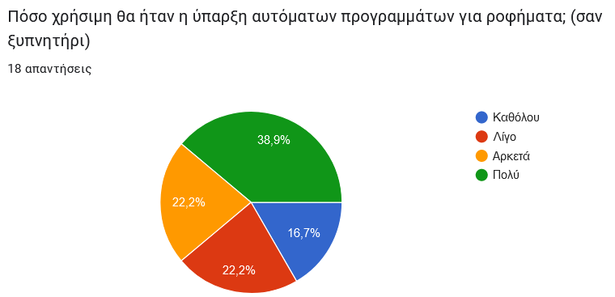
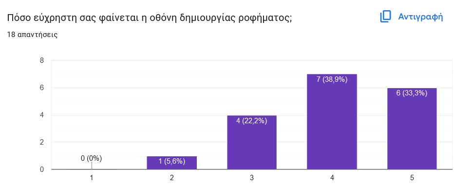
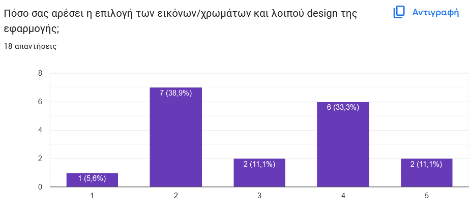
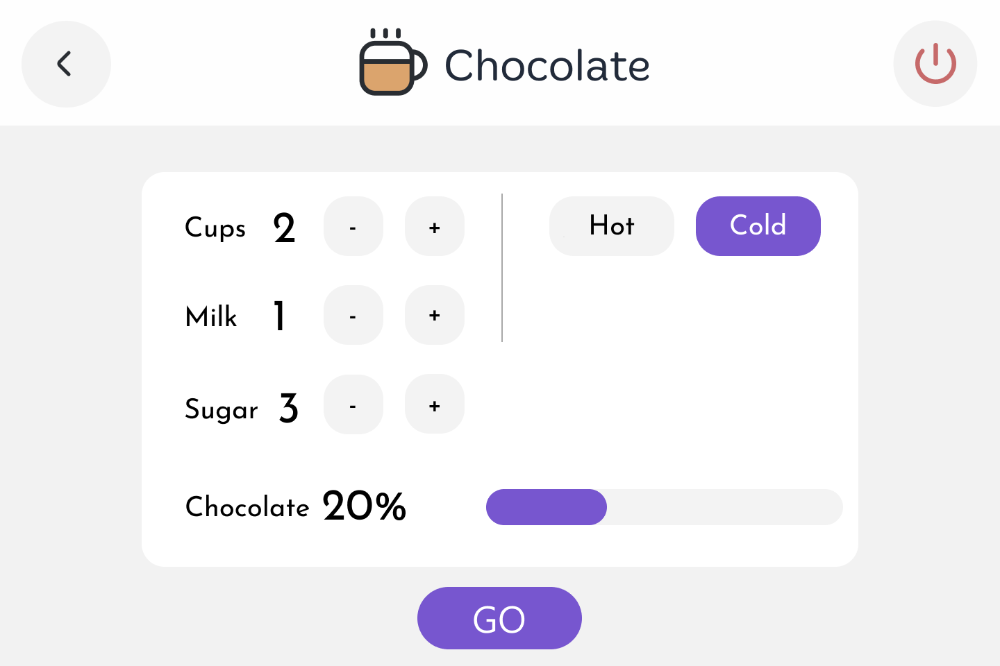
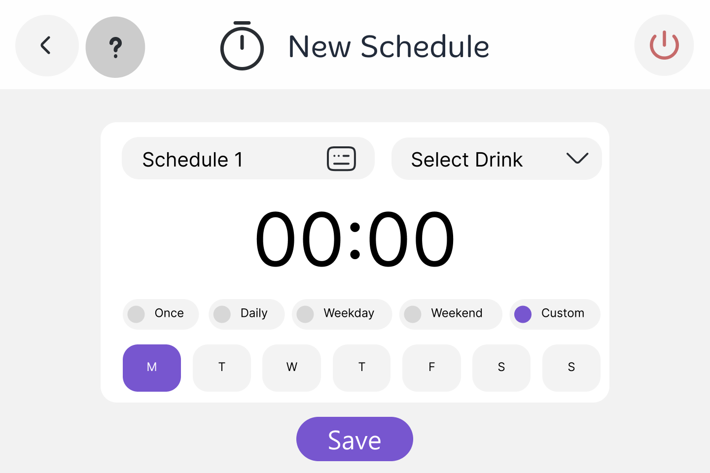
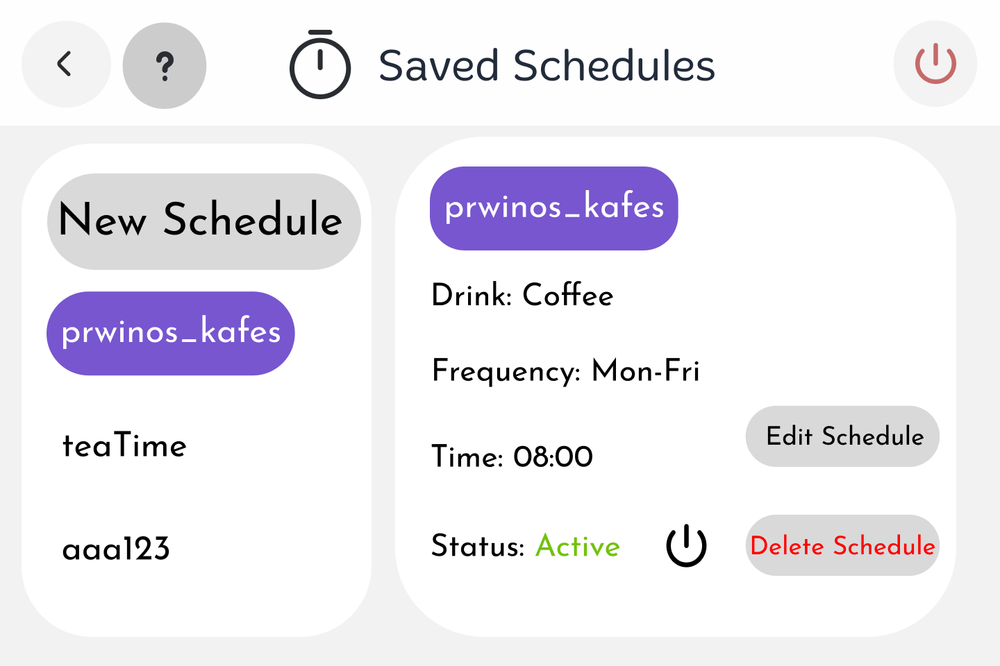

# Human-Computer Interaction: Term Assignment

#### Ιωάννης Γκιώνης 3190044
#### Τσίρμπας Δημήτρης 3190205

## Subject

Our assignment is about developing a friendly User Interface (UI) for a common, commercial coffee 
machine. The reasons that led us choosing this device are:

- Making drinks (e.g coffee, tea, hot chocolate) is a simple and repetitive task for most users.
- Most commercially available machines do not support generally requested features such as having
    a drink ready at a certain time each day.
- Machines that do, make use of a primitive and often counter-intuitive interfaces
(e.g few, small buttons).
- Most machines support poorly people with visual disabilities.

Our project strives to offer an easy-to-use, accessible interface supporting advanced features such
as automatic drink creation.  

This report is composed of 4 parts: The 1st, 2nd and 3rd development cycles of the project and an 
addendum where we place additional files and images pertaining to various development stages.

## 1st Cycle

The goals of the 1st development cycle are:

- Defining the base model on which the UI will be based
- Selecting and defining the features our prospective users will be interested in
- Producing mock-up versions of our various screens and menus
- Using the mock-ups to generate feedback from our users

### The model
The model we are using is the KRUPS coffee machine. It's an old model which specializes in producing
coffee and espresso. It can also technically produce hot chocolate and tea, so it fits our 
requirements.

This model is also notorious for its poor UI. All its functions are directed using a lever and 4 
small buttons which have to be pressed in non-obvious sequences. It goes without saying that it is 
also a nightmare for people with visual impairments.

*Our base model*

### Target audience

Our target audience comprises of young students and professionals. The reasons we picked this 
particular group are:

- They are generally accustomed with technology and are thus more likely to choose a GUI rather than 
a traditional, tactile UI
- They make frequent, daily use of drinks (especially coffee) 

We also focus on people with visual impairments, as accessibility is one of the greater strengths of 
designing a graphical user interface.

### Functional Requirements

- The system must support 4 kinds of drinks: french coffee/americano, espresso, tea and hot 
chocolate.
- The system must warn the user in case of missing or low ingredients (e.g water, filters)
- The system must save the last used drink configuration for each drink and load it when that drink
is requested.
- The system must support repeatable schedules where the user can request a drink be made at a 
specific time, for a specific day.
- The system must support viewing, activating, deactivating and deleting schedules.
- The system must contain tutorials for each screen.

### Non-functional Requirements

- Each screen must be non-scrollable.
- For a given, ordinary task a maximum of 2 screens must be used.
- The system must be usable for people with severe visual impairments
- A new user should get accustomed to the basic features within 2 minutes

### Verification

We used three forms of verification for the 1st development cycle;

#### Questionnaires
Used to verify functional requirements and to gather general feedback about our 
design. Our questionnaire was given to 18 students, was comprised of 10 questions and was submitted 
using Google Forms. Information about the results of the questionnaire and how it impacted our 
decisions can be found in [Addendum#Questionnaire findings](#questionnaire-findings).

#### Interviews
Participants were asked to suggest features and give us feedback
about specific design decisions. The interviews were kept mostly open and unstructured as to allow
more general suggestions since the design was still in its early stages.

#### Group verification
The project was presented to an audience of 15-20 people where many design aspects were discussed.
The original presentation can be found [here](presentations/cycle1_presentation_gr.pptx).

### Results

Besides adapting our functional requirements, the feedback we received helped us adapt the general
design of our application. Below are two before-and-after pictures demonstrating the changes we made.
A full list of our final designs can be found in [Addendum#Mock-ups](#mock-ups).

#### Before

 *Old main menu*

 *Old drink creation screen*

#### After

 *New main menu*

 *New drink creation screen*

## Addendum

### Questionnaire findings

Our original form can be found [here](https://forms.gle/RRxYVQZFafGN1ZDt6). Note that the stats
presented below are not a comprehensive list of all the questions.

We should first verify that the responders belong in our target audience;

 *The age of the responders*

We must now check our assumptions that our users;
1. Drink coffee on a regular basis
2. Want a graphical UI for their coffee machine
3. Want a programmable schedule for making drinks 

*How often our responders drink drinks*

We can see that more than 50% of our users drink some sort of drink on a daily basis, with only 27%
declaring rare/no use of drinks.

 *How many responders would find a GUI coffee machine useful*

While not essential to them, most responders would find a GUI somewhat useful.

 *How many responders would find a scheduling feature useful*

We can see that a clear majority believe such a feature would be useful.

We can now start asking about the qualitative characteristics of our app:

 *Ease-of-use of the drink creation screen*

 *Ease-of-use of the drink scheduling screen*

 *General app design*

Our findings indicate that our responders feel that our main screens are well understood, but there
are complaints about our general design. These (according to open answers given at the end of the
questionnaire), concerned the font, images and background color used.

### Mock-ups

This section includes all the final mock-up screens developed during the 1st development cycle.

 *Main Menu*

 *French coffee creation screen*

 *Espresso creation screen*

 *Tea creation screen*

 *Hot chocolate creation screen*

 *Schedule screen*

 *Schedule management screen*

